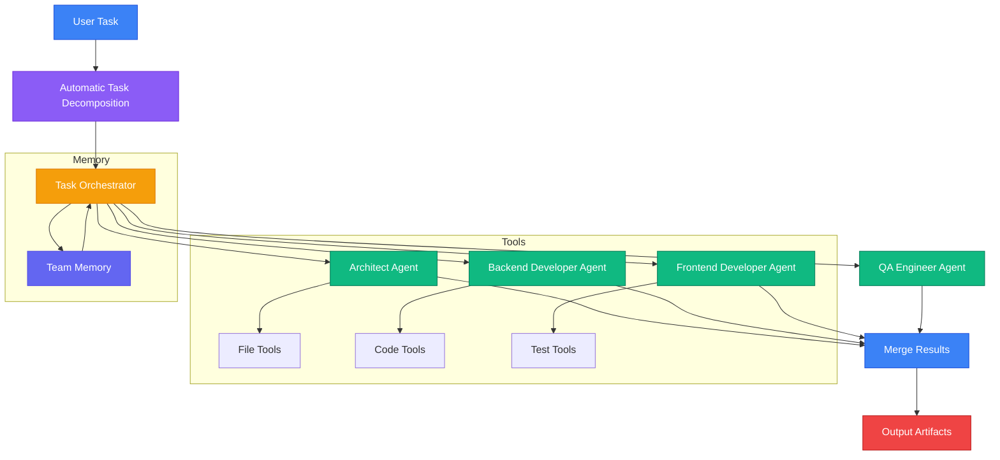

# Agent Team Orchestrator (ATO)

**Multi-Agent Collaboration System Based on LangGraph**

[中文文档](README_CN.md)

Agent Team Orchestrator (ATO) is a multi-agent collaboration orchestration system that decomposes complex tasks into subtasks using LangGraph and assigns them to specialized AI Agents for execution. It supports tool calling, team memory sharing, checkpoint resumption, and seamless integration with Claude Code via MCP.

## Features

- **Multi-LLM Provider Support**: Claude Code CLI, Anthropic Claude, OpenAI, and local models (Ollama)
- **Role-Based Agents**: Pre-configured roles like architect, backend developer, tester, with custom role support
- **Automatic Task Decomposition**: Intelligently breaks down complex tasks into executable subtasks
- **Parallel Execution**: Multiple agents work simultaneously with dependency management
- **LangGraph Orchestration**: DAG-based task execution with checkpoint resumption
- **Structured Claude CLI Tool Bridge**: Claude Code CLI agents can request tools through a JSON protocol without relying on native LangChain tool calls
- **Tool Policy and Audit Trail**: Read-only tools run automatically; write, command, test, and git tools require explicit local auto-approval and are logged to `tool-audit.jsonl`
- **Team Memory**: Shared context storage with architecture decision records and code change tracking
- **MCP Integration**: Seamless integration with Claude Code as an MCP Server
- **CLI Tool**: Command-line interface for task execution and management

## Quick Start

### Requirements

- Python 3.10+
- Node.js 18+
- pnpm 9+

### Installation

```bash
# Clone repository
git clone https://github.com/spacesky-cell/agent-team-orchestrator.git
cd agent-team-orchestrator

# Create Python virtual environment
python -m venv .venv
source .venv/bin/activate  # Linux/Mac
# or .venv\Scripts\activate  # Windows

# Install Python dependencies
python -m pip install -e packages/core[dev]

# Install Node.js dependencies
pnpm install

# If pnpm blocks esbuild scripts, approve the build once
pnpm approve-builds

# Build TypeScript packages
pnpm run build

# Smoke-check local CLI/Python wiring without calling an LLM
node packages/cli/dist/index.js doctor
```

### Configure LLM Access

```bash
# Copy environment variable example file
cp .env.example .env

# Default: no API key required if Claude Code CLI is already logged in
# Default: LLM_PROVIDER=claude-cli reuses your local Claude Code login
# Anthropic direct API: ANTHROPIC_API_KEY=your-key
# OpenAI: OPENAI_API_KEY=your-key
# NVIDIA API: OPENAI_API_KEY=nvapi-xxx, OPENAI_BASE_URL=https://integrate.api.nvidia.com/v1
```

## One-Click Multi-Agent Collaboration

### Method 1: Via MCP Server (Recommended)

The repository includes a project-level `.mcp.json` for Claude Code CLI:

```json
{
  "mcpServers": {
    "ato": {
      "command": "node",
      "args": ["packages/mcp-server/dist/index.js"],
      "env": {
        "LLM_PROVIDER": "claude-cli"
      }
    }
  }
}
```

The default `claude-cli` provider reuses your local authenticated Claude Code CLI. If you prefer direct API access, keep the real API key in the shell environment or `.env`; do not commit it:

```bash
ANTHROPIC_API_KEY=your-key
```

After building, verify Claude Code can see the project MCP server:

```bash
claude mcp list
claude mcp get ato
```

Then in Claude Code, simply call:

```
Use self_check first, then create_team_task.
```

The system will automatically:
1. Decompose the task into multiple subtasks
2. Assign to appropriate agent roles
3. Execute all subtasks in parallel
4. Execute allowed project tools through the structured tool bridge
5. Merge results and save `result.json` plus `tool-audit.jsonl`

**Example:**

```
create_team_task("Develop a user authentication system with registration, login, and logout features")
```

The system will automatically create subtasks like:

| Subtask | Role | Status |
|---------|------|--------|
| Design authentication system architecture | architect | ✓ Complete |
| Implement user registration API | backend-developer | ✓ Complete |
| Implement login API | backend-developer | ✓ Complete |
| Implement logout API | backend-developer | ✓ Complete |
| Write test cases | tester | ✓ Complete |

### Method 2: Via Python Script

```python
from src.orchestrator.simple_orchestrator import SimpleOrchestrator

orchestrator = SimpleOrchestrator()

# One-line multi-agent collaboration
decomposition = orchestrator.decompose_task("Develop a user authentication system")
result = orchestrator.execute_task(decomposition)
```

### Method 3: Via CLI

```bash
node packages/cli/dist/index.js run "Develop a user authentication system"
```

## Architecture Diagram



### Project Structure

```
ato/
├── packages/
│   ├── core/           # Python core (LangGraph orchestration)
│   │   └── src/
│   │       ├── orchestrator/    # LangGraph orchestrators
│   │       ├── models/          # LLM providers, roles, states
│   │       ├── tools/           # File and code operation tools
│   │       ├── memory/          # Team memory module
│   │       └── prompts/         # Task decomposition prompts
│   ├── mcp-server/     # TypeScript MCP Server
│   ├── cli/            # TypeScript CLI
│   └── shared/         # Shared type definitions
├── roles/              # Role definition files (YAML)
├── .ato/               # Team memory storage
├── ato-output/         # Task artifacts and checkpoints
└── docs/               # Documentation
```

### Core Components

#### 1. Orchestrators (`packages/core/src/orchestrator/`)

- **SimpleOrchestrator**: Simple sequential orchestrator
  - Automatic task decomposition
  - Sequential subtask execution
  - Good for rapid prototyping

- **ToolEnabledOrchestrator**: Main orchestrator with tool calling
  - ReAct loop pattern agent execution
  - Structured Claude CLI JSON tool-call protocol
  - Tool policy and JSONL audit logging
  - SQLite checkpoint persistence
  - Parallel subtask execution
  - Team memory integration

#### 2. Tools (`packages/core/src/tools/`)

- **File Tools**: `read_file`, `write_file`, `list_directory`, `delete_file`
- **Code Tools**: `search_code`, `execute_command`, `analyze_file`, `run_tests`, `git_commit`

#### 3. Team Memory (`packages/core/src/memory/`)

- Architecture Decision Records (ADR)
- Code change tracking
- ChromaDB semantic search (optional)
- Agent context retrieval

## Built-in Roles

| Role | ID | Description |
|------|-----|------|
| Software Architect | `architect` | System architecture, tech stack selection, API design |
| Backend Developer | `backend-developer` | API implementation, business logic, unit tests |
| Frontend Developer | `frontend-developer` | UI components, state management, styling |
| Fullstack Developer | `fullstack-developer` | End-to-end feature implementation |
| QA Engineer | `tester` | Test strategy, test cases, automated testing |

### Adding Custom Roles

Create a new YAML file in the `roles/` directory:

```yaml
# roles/my-custom-role.yaml
id: my-custom-role
name: Custom Role
description: Role description
expertise:
  - Skill 1
  - Skill 2
tools:
  - read_file
  - write_file
  - search_code
  - execute_command
system_prompt: |
  You are a professional...

  Current project context:
  {{context}}

  Please start your task.
deliverables:
  - format: markdown
    description: Expected output description
```

## Claude Code Integration (MCP)

### Configure MCP Server

The repository includes a project-level `.mcp.json` for Claude Code:

```json
{
  "mcpServers": {
    "ato": {
      "command": "node",
      "args": ["packages/mcp-server/dist/index.js"],
      "env": {
        "LLM_PROVIDER": "claude-cli"
      }
    }
  }
}
```

The default `claude-cli` provider reuses your local authenticated Claude Code CLI. For direct API mode, keep real API keys in your shell or `.env`, not in committed MCP config:

```bash
ANTHROPIC_API_KEY=your-key
claude mcp list
claude mcp get ato
```

### Available MCP Tools

| Tool | Description |
|------|------|
| `create_team_task` | Create and execute team task with automatic decomposition and multi-agent parallel execution |
| `get_task_status` | Query task execution status, artifact list, and tool audit summary |
| `get_task_audit` | Summarize tool execution audit events from `tool-audit.jsonl` |
| `approve_step` | Approve/reject current step (for manual approval workflows) |
| `list_available_roles` | List all available agent roles with their capabilities |
| `list_incomplete_tasks` | List incomplete tasks (useful for resuming interrupted work) |
| `query_team_memory` | Search team memory for relevant context using semantic search |
| `get_memory_summary` | Get team memory summary |
| `self_check` | Check Python path, role loading, and LLM environment without calling an LLM |

### MCP Usage Examples

#### 1. Create Multi-Agent Collaboration Task

```
create_team_task(
  description: "Develop a todo management API with CRUD operations",
  outputDir: "./ato-output",
  projectRoot: "."
)
```

The system will automatically:
- Decompose task into multiple subtasks
- Assign to appropriate roles (architect, backend developer, QA engineer, etc.)
- Execute all subtasks in parallel
- Save results to `ato-output/result.json`

#### 2. Query Task Status

```
get_task_status(taskId: "task-123456")
```

Returns:
- Overall status (pending/running/completed/failed)
- Individual subtask statuses
- Artifact list
- Tool audit counts and recent events

#### 3. Query Tool Audit

```
get_task_audit(outputDir: "./ato-output")
```

Returns:
- Audit file path
- Completed, blocked, failed, and parse-error counts
- Recent tool calls with decisions and errors

#### 4. List Available Roles

```
list_available_roles()
```

Returns all available roles with their expertise and available tools.

#### 5. Search Team Memory

```
query_team_memory(
  query: "database design",
  topK: 5
)
```

Returns architecture decisions and code changes related to the query.

## CLI Commands

```bash
# Show help
ato --help

# Check Python path, role loading, and LLM environment
ato doctor

# Run a task
ato run "Design and implement a user authentication system"

# Specify output directory
ato run "Your task" --output ./my-output

# List available roles
ato roles

# Query task status
ato status <task-id>

# Summarize tool execution audit
ato audit

# List incomplete tasks
ato tasks

# Get team memory summary
ato memory

# Initialize project
ato init
```

## Team Memory

Team memory provides shared context across agent executions:

### Features

- **Architecture Decision Records (ADR)**: Record and retrieve architecture decisions
- **Code Change Tracking**: Track file modifications by agents
- **Semantic Search**: Query relevant context using natural language (requires ChromaDB)
- **Context Injection**: Automatically inject relevant context into agent prompts

### Usage Example

```python
from memory.team_memory import TeamMemory

memory = TeamMemory(project_root=".")

# Record architecture decision
memory.record_decision(
    title="Use PostgreSQL as primary database",
    content="Chose PostgreSQL for its strong JSON support and full-text search capabilities...",
    agent_role="architect",
    rationale="Need ACID compliance and complex query capabilities"
)

# Record code change
memory.record_code_change(
    file_path="src/api/users.py",
    change_type="modify",
    description="Add user authentication endpoint",
    agent_role="backend-developer"
)

# Retrieve relevant context
context = memory.retrieve_relevant_context(
    query="How is authentication implemented?",
    top_k=5
)
```

## Configuration Options

### Environment Variables

| Variable | Default | Description |
|----------|---------|-------------|
| `LLM_PROVIDER` | `claude-cli` | LLM provider: claude-cli, anthropic, openai, ollama |
| `LLM_MODEL` | `claude-sonnet-4-20250514` | Model name |
| `LLM_TEMPERATURE` | `0.7` | Generation temperature |
| `LLM_MAX_TOKENS` | `4096` | Maximum tokens |
| `ATO_MAX_TOOL_ITERATIONS` | `10` | Maximum Claude CLI structured tool-call loop iterations |
| `ATO_AUTO_APPROVE_TOOLS` | - | Set to `1` to allow restricted tools such as `execute_command`, `run_tests`, `write_file`, and `git_commit` during local debugging |
| `ANTHROPIC_API_KEY` | - | Anthropic API Key |
| `OPENAI_API_KEY` | - | OpenAI API Key |
| `OPENAI_BASE_URL` | - | OpenAI API base URL (for custom endpoints like NVIDIA API) |
| `OLLAMA_BASE_URL` | `http://localhost:11434` | Ollama API address |

### Using NVIDIA API

```bash
# .env file
LLM_PROVIDER=openai
LLM_MODEL=z-ai/glm4.7
OPENAI_API_KEY=nvapi-xxx
OPENAI_BASE_URL=https://integrate.api.nvidia.com/v1
```

## Development

```bash
# Run tests
python -m pytest packages/core/tests -v

# Build TypeScript packages
pnpm run build

# Run TypeScript tests
pnpm exec vitest run --passWithNoTests

# Format Python code
black packages/core/src/

# Python code linting
ruff check packages/core/src/
```

## License

[MIT](LICENSE)
