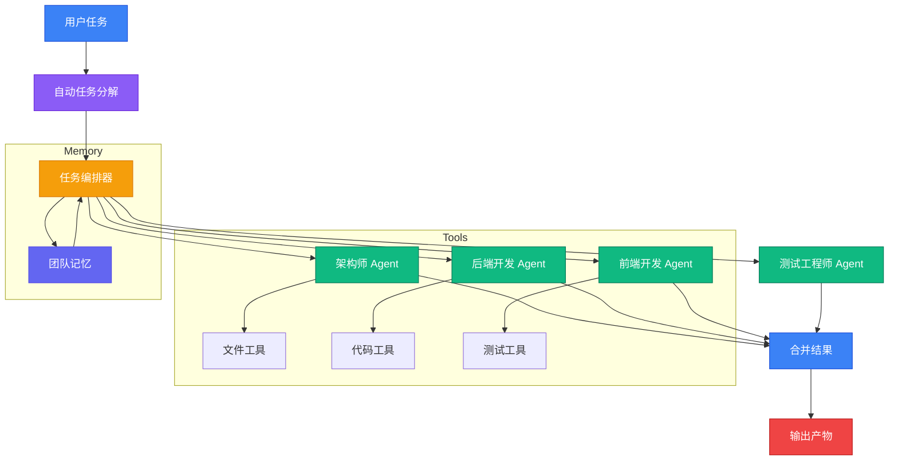

# Agent Team Orchestrator (ATO)

**基于 LangGraph 的多智能体协作系统**

[English](README.md)

Agent Team Orchestrator (ATO) 是一个多智能体协作编排系统，通过 LangGraph 将复杂任务分解为子任务，并分配给专业化的 AI Agent 执行。支持工具调用、团队记忆共享、断点续跑等功能，可通过 MCP 与 Claude Code 无缝集成。

## 功能特性

- **多 LLM 提供商支持**: 支持 Anthropic Claude、OpenAI、NVIDIA API 等和本地模型 (Ollama)
- **角色化 Agent**: 预置架构师、后端开发、测试工程师等专业角色，支持自定义
- **自动任务分解**: 智能将复杂任务拆解为可执行的子任务
- **并行执行**: 多个 Agent 同时工作，支持依赖管理
- **LangGraph 编排**: 基于 DAG 的任务执行，支持断点续跑
- **工具调用能力**: Agent 可以读写文件、执行命令、运行测试、提交代码
- **团队记忆**: 共享上下文存储，支持架构决策记录和代码变更追踪
- **MCP 集成**: 可作为 MCP Server 与 Claude Code 无缝集成
- **CLI 工具**: 命令行工具用于任务执行和管理

## 快速开始

### 环境要求

- Python 3.10+
- Node.js 18+
- pnpm 或 npm

### 安装步骤

```bash
# 克隆仓库
git clone <your-repo-url>
cd ato

# 创建 Python 虚拟环境
python -m venv .venv
source .venv/bin/activate  # Linux/Mac
# 或 .venv\Scripts\activate  # Windows

# 安装 Python 依赖
pip install -e packages/core

# 安装 Node.js 依赖
npm install

# 构建 TypeScript 包
npm run build
```

### 配置 API Key

```bash
# 复制环境变量示例文件
cp .env.example .env

# 编辑 .env 文件，添加你的 API Key
# Anthropic: ANTHROPIC_API_KEY=your-key
# OpenAI: OPENAI_API_KEY=your-key
# NVIDIA API: OPENAI_API_KEY=nvapi-xxx, OPENAI_BASE_URL=https://integrate.api.nvidia.com/v1
```

## 一键启动多 Agent 协作

### 方式 1：通过 MCP Server（推荐）

在 Claude Code 配置文件中添加：

```json
{
  "mcpServers": {
    "ato": {
      "command": "node",
      "args": ["./packages/mcp-server/dist/index.js"],
      "env": {
        "ANTHROPIC_API_KEY": "your-key"
      }
    }
  }
}
```

然后在 Claude Code 中直接调用：

```
使用 create_team_task 工具，描述你的任务
```

系统会自动：
1. 分解任务为多个子任务
2. 分配给合适的 Agent 角色
3. 并行执行所有子任务
4. 合并结果并保存

**示例：**

```
create_team_task("开发一个用户认证系统，包括注册、登录、登出功能")
```

系统会自动创建类似以下的子任务：

| 子任务 | 角色 | 状态 |
|--------|------|------|
| 设计认证系统架构 | architect | ✓ 完成 |
| 实现用户注册接口 | backend-developer | ✓ 完成 |
| 实现登录接口 | backend-developer | ✓ 完成 |
| 实现登出接口 | backend-developer | ✓ 完成 |
| 编写测试用例 | tester | ✓ 完成 |

### 方式 2：通过 Python 脚本

```python
from src.orchestrator.simple_orchestrator import SimpleOrchestrator

orchestrator = SimpleOrchestrator()

# 一句话启动多 Agent 协作
decomposition = orchestrator.decompose_task("开发一个用户认证系统")
result = orchestrator.execute_task(decomposition)
```

### 方式 3：通过 CLI

```bash
node packages/cli/dist/index.js run "开发一个用户认证系统"
```

## 架构图



### 项目结构

```
ato/
├── packages/
│   ├── core/           # Python 核心（LangGraph 编排）
│   │   └── src/
│   │       ├── orchestrator/    # LangGraph 编排器
│   │       ├── models/          # LLM 提供商、角色、状态
│   │       ├── tools/           # 文件和代码操作工具
│   │       ├── memory/          # 团队记忆模块
│   │       └── prompts/         # 任务分解提示词
│   ├── mcp-server/     # TypeScript MCP Server
│   ├── cli/            # TypeScript CLI
│   └── shared/         # 共享类型定义
├── roles/              # 角色定义文件 (YAML)
├── .ato/               # 团队记忆存储
├── ato-output/         # 任务产物和检查点
└── docs/               # 文档
```

### 核心组件

#### 1. 编排器 (`packages/core/src/orchestrator/`)

- **SimpleOrchestrator**: 简单顺序编排器
  - 自动任务分解
  - 顺序执行子任务
  - 适合快速原型开发

- **ToolEnabledOrchestrator**: 支持工具调用的主编排器
  - ReAct 循环模式执行 Agent
  - SQLite 检查点持久化
  - 并行子任务执行
  - 团队记忆集成

#### 2. 工具 (`packages/core/src/tools/`)

- **文件工具**: `read_file`, `write_file`, `list_directory`, `delete_file`
- **代码工具**: `search_code`, `execute_command`, `analyze_file`, `run_tests`, `git_commit`

#### 3. 团队记忆 (`packages/core/src/memory/`)

- 架构决策记录 (ADR)
- 代码变更追踪
- ChromaDB 语义搜索（可选）
- Agent 上下文检索

## 内置角色

| 角色 | ID | 描述 |
|------|-----|------|
| 软件架构师 | `architect` | 系统架构、技术选型、API 设计 |
| 后端开发工程师 | `backend-developer` | API 实现、业务逻辑、单元测试 |
| 前端开发工程师 | `frontend-developer` | UI 组件、状态管理、样式实现 |
| 全栈开发工程师 | `fullstack-developer` | 端到端功能实现 |
| 测试工程师 | `tester` | 测试策略、测试用例、自动化测试 |

### 添加自定义角色

在 `roles/` 目录创建新的 YAML 文件：

```yaml
# roles/my-custom-role.yaml
id: my-custom-role
name: 自定义角色
description: 角色描述
expertise:
  - 技能1
  - 技能2
tools:
  - read_file
  - write_file
  - search_code
  - execute_command
system_prompt: |
  你是一个专业的...

  当前项目上下文：
  {{context}}

  请开始你的任务。
deliverables:
  - format: markdown
    description: 期望输出描述
```

## Claude Code 集成 (MCP)

### 配置 MCP Server

在 Claude Code 配置文件中添加 ATO 作为 MCP Server：

#### 方式一：使用本地构建

```json
{
  "mcpServers": {
    "ato": {
      "command": "node",
      "args": ["./packages/mcp-server/dist/index.js"],
      "env": {
        "ANTHROPIC_API_KEY": "your-key"
      }
    }
  }
}
```

#### 方式二：使用 npx（需要发布到 npm）

```json
{
  "mcpServers": {
    "ato": {
      "command": "npx",
      "args": ["@ato/mcp-server"],
      "env": {
        "ANTHROPIC_API_KEY": "your-key"
      }
    }
  }
}
```

### 可用 MCP 工具

| 工具 | 描述 |
|------|------|
| `create_team_task` | 创建并执行团队任务，自动分解并多 Agent 并行执行 |
| `get_task_status` | 查询任务执行状态 |
| `approve_step` | 批准/拒绝当前步骤（用于人工审批流程） |
| `list_available_roles` | 列出所有可用角色及其能力 |
| `list_incomplete_tasks` | 列出未完成任务（用于恢复中断的工作） |
| `query_team_memory` | 搜索团队记忆，返回相关的架构决策和代码变更 |
| `get_memory_summary` | 获取团队记忆摘要 |

### MCP 使用示例

#### 1. 创建多 Agent 协作任务

```
create_team_task(
  description: "开发一个待办事项管理 API，支持增删改查功能",
  outputDir: "./ato-output",
  projectRoot: "."
)
```

系统会自动：
- 分解任务为多个子任务
- 分配给合适的角色（架构师、后端开发、测试工程师等）
- 并行执行所有子任务
- 保存结果到 `ato-output/result.json`

#### 2. 查询任务状态

```
get_task_status(taskId: "task-123456")
```

返回：
- 整体状态（pending/running/completed/failed）
- 各子任务状态
- 产物列表

#### 3. 查看可用角色

```
list_available_roles()
```

返回所有可用角色及其专业领域和可用工具。

#### 4. 搜索团队记忆

```
query_team_memory(
  query: "数据库设计",
  topK: 5
)
```

返回与查询相关的架构决策和代码变更记录。

## CLI 命令

```bash
# 显示帮助
ato --help

# 运行任务
ato run "设计并实现一个用户认证系统"

# 指定输出目录
ato run "你的任务" --output ./my-output

# 列出可用角色
ato roles

# 查询任务状态
ato status <task-id>

# 列出未完成任务
ato tasks

# 获取团队记忆摘要
ato memory

# 初始化项目
ato init
```

## 团队记忆

团队记忆提供跨 Agent 执行的共享上下文：

### 功能

- **架构决策记录 (ADR)**: 记录和检索架构决策
- **代码变更追踪**: 追踪 Agent 对文件的修改
- **语义搜索**: 使用自然语言查询查找相关上下文（需要 ChromaDB）
- **上下文注入**: 自动将相关上下文注入到 Agent 提示词中

### 使用示例

```python
from memory.team_memory import TeamMemory

memory = TeamMemory(project_root=".")

# 记录架构决策
memory.record_decision(
    title="使用 PostgreSQL 作为主数据库",
    content="选择 PostgreSQL 是因为其强大的 JSON 支持和全文搜索功能...",
    agent_role="architect",
    rationale="需要 ACID 兼容和复杂查询能力"
)

# 记录代码变更
memory.record_code_change(
    file_path="src/api/users.py",
    change_type="modify",
    description="添加用户认证接口",
    agent_role="backend-developer"
)

# 检索相关上下文
context = memory.retrieve_relevant_context(
    query="认证是如何实现的？",
    top_k=5
)
```

## 配置选项

### 环境变量

| 变量 | 默认值 | 描述 |
|------|---------|------|
| `LLM_PROVIDER` | `anthropic` | LLM 提供商: anthropic, openai, ollama |
| `LLM_MODEL` | `claude-sonnet-4-20250514` | 模型名称 |
| `LLM_TEMPERATURE` | `0.7` | 生成温度 |
| `LLM_MAX_TOKENS` | `4096` | 最大 token 数 |
| `ANTHROPIC_API_KEY` | - | Anthropic API Key |
| `OPENAI_API_KEY` | - | OpenAI API Key |
| `OPENAI_BASE_URL` | - | OpenAI API 基础 URL（用于自定义端点，如 NVIDIA API） |
| `OLLAMA_BASE_URL` | `http://localhost:11434` | Ollama API 地址 |

### 使用 NVIDIA API

```bash
# .env 文件
LLM_PROVIDER=openai
LLM_MODEL=z-ai/glm4.7
OPENAI_API_KEY=nvapi-xxx
OPENAI_BASE_URL=https://integrate.api.nvidia.com/v1
```

## 开发

```bash
# 运行测试
cd packages/core && pytest

# 构建 TypeScript 包
npm run build

# 格式化 Python 代码
black packages/core/src/

# Python 代码检查
ruff check packages/core/src/
```

## 许可证

[MIT](LICENSE)
