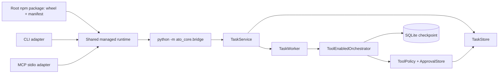

# Architecture

ATO has one owner layer and two adapters.



## Ownership

`ato_core` owns task IDs, state transitions, decomposition validation, parallel graph execution, tool policy, approval decisions, audit events, worker health, memory, and bridge schemas.

TypeScript owns Python discovery, managed-runtime provisioning, process transport, CLI rendering, MCP schemas, and protocol error mapping. The root npm package owns the bundled wheel and hash manifest; shared code validates them and creates a versioned virtual environment. TypeScript never infers business status from checkpoint or result files.

## Managed runtime boundary

The root command shims set the absolute bundled manifest path before dynamically loading the CLI or MCP adapter. Discovery first honors a compatible explicit/project/system Python, then lazily provisions the bundled wheel when no existing core is available. Provisioning validates schema, version, path containment, and SHA-256 before any subprocess starts.

Installations use a version-scoped exclusive lock, bounded subprocesses, a temporary directory, live core-version probes, and atomic promotion. The ready marker records only version, wheel hash, executable path, and completion time. Installation diagnostics are bounded and redacted on stderr; JSON bridge and MCP stdout remain machine-only.

## Task lifecycle

```text
queued -> decomposing -> running -> completed
                            |  |
                            |  +-> failed
                            +-> waiting_approval -> running
                                                   or blocked
```

Transitions are validated and written atomically to `task.json`. Terminal results are written only for `completed`, `blocked`, or `failed` tasks.

## Parallel execution

The supervisor identifies dependency-ready subtasks and dispatches each through a LangGraph `Send` branch. A branch returns only a reducer-safe `SubtaskExecutionResult`. The supervisor applies each execution ID once, preventing concurrent writes to canonical artifacts and subtask state.

## Approval resume

Mutating tool calls receive a deterministic request key for node replay. The request is appended before LangGraph `interrupt()`. A separate process persists the exact decision, then invokes the same checkpoint with `Command(resume=...)`. Request IDs are validated before a tool executes; approved tools execute once and rejected tasks become blocked.

## Process boundary

The bridge accepts one UTF-8 JSON object on stdin and emits one JSON response for one-shot commands. It also tolerates the UTF-8 BOM produced by some Windows stdin writers. The Node client requires exactly one response line and treats additional human text as `BRIDGE_PROTOCOL_ERROR`.

Background workers are launched with argument arrays and `shell=false`. Heartbeat and PID checks occur on status reads; there is no unbounded health polling thread.
